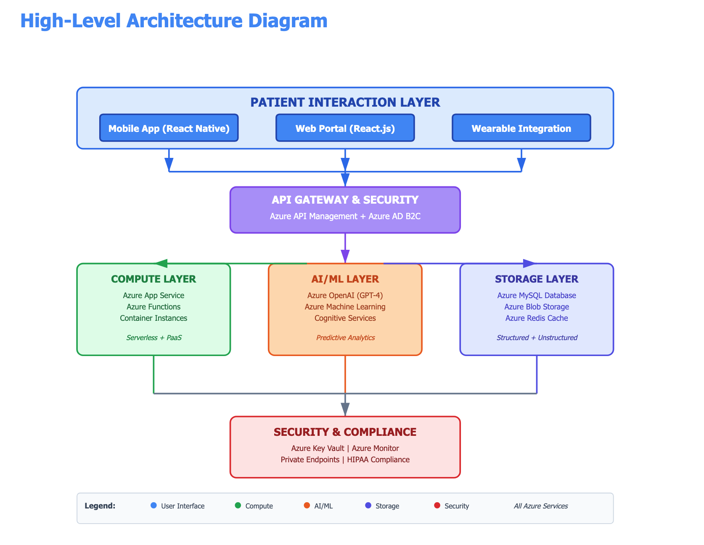

# **FibroTrack**: A Cloud-based Fibromyalgia Pain Management App

## Description:

Software architecture of a health use-case based app is created. This will be used to create a comprehensive solution architectureand implementation plan later. This is just an overview, and works almost like a template to build on.  

The accompanying [Fibrotrack_Prototype](https://github.com/briggsprashar/software_architecture/blob/main/Fibrotrack_Prototype.html) is a html file that is a sample prototype for the app. The prototype is created with the assistance of an online AI tool. 

To preview the prototype, 
1) go to 
```
https://htmlpreview.github.io/
```
2) paste the raw url below

```
https://raw.githubusercontent.com/briggsprashar/software_architecture/refs/heads/main/Fibrotrack_Prototype.html 
``` 

3) click on `Preview` to render the html as a webpage

## Solution Architecture & Implementation Plan

## Table of Contents

1. [Healthcare Problem Statement](#healthcare-problem-statement)
2. [Solution Architecture](#solution-architecture-overview)
3. [Relationship Map](#relationship-map)
4. [Mapping to Architecture Principles](#mapping-to-architecture-principles)
5. [Architecture Layers and Components](#architecture-layers-and-components)
4. [Azure Service Mapping and Sample Configuration](#azure-service-mapping-and-sample-configuration)
6. [Data Flow Example](#data-flow-example)
7. [Database Design - Azure MySQL](#database-design---azure-mysql)
8. [12-Week Implementation Plan](#12-week-implementation-plan)
9. [Security and HIPAA Compliance](#security-and-hipaa-compliance)
10. [Cost Analysis and Optimization](#cost-analysis-and-optimization)
11. [Success Metrics and Expected Outcomes](#success-metrics-and-expected-outcomes)
12. [AI-Based Components](#ai-based-components)
13. [Architectural Decision Guardrails](#architectural-decision-guardrails)
11. [Summary](#summary)
12. [References](#references)

---

*TBD Later* > Indicates parts that can be completed in the later capstone project

## Healthcare Problem Statement

### Challenge
Fibromyalgia patients experience chronic widespread pain that varies in intensity and location, making pain management extremely challenging. Traditional pain tracking relies on sporadic clinic visits and paper diaries, providing incomplete data for treatment optimization.<sup>1</sup>

### Impact
Healthcare providers lack real-time insights into pain patterns, medication effectiveness, and trigger identification, resulting in suboptimal treatment plans and poor patient outcomes. This leads to increased emergency department visits, medication non-adherence, and reduced quality of life.<sup>1</sup>

### Solution
A comprehensive cloud-based pain management platform that enables continuous symptom monitoring, personalized treatment recommendations, and data-driven care optimization using Microsoft Azure cloud services.

---

## Solution Architecture Overview

FibroTrack is a multi-tier cloud-native architecture leveraging Azure Platform-as-a-Service (PaaS) and serverless technologies, The features of this will be that the app will be a scalable, secure, and HIPAA-compliant healthcare platform. The design below prioritizes data security, real-time processing capabilities, and AI-powered clinical insights.

## Architecture Diagram 



*Credit: Mermaid Charts*

## Relationship Map

**FibroTrack**

    subgraph **Patient**["Patient Interaction Layer"]
        A[Mobile App<br/>React Native]
        B[Web Portal<br/>React.js]
        C[Wearable Devices<br/>Fitbit/Apple Health]
    end
    
    subgraph **Gateway**["API Gateway & Security"]
        D[Azure API Management]
        E[Azure AD B2C<br/>Authentication]
    end
    
    subgraph **Compute**["Compute Layer"]
        F[Azure App Service<br/>Node.js Backend]
        G[Azure Functions<br/>Serverless Events]
        H[Container Instances<br/>ML Serving]
    end
    
    subgraph **AI**["AI/ML Layer"]
        I[Azure OpenAI<br/>GPT-4]
        J[Azure Machine Learning<br/>LSTM Models]
        K[Cognitive Services<br/>Speech & Vision]
    end
    
    subgraph **Storage**["Storage Layer"]
        L[(Azure MySQL<br/>Flexible Server)]
        M[Azure Blob Storage<br/>Images & Files]
        N[Azure Redis Cache<br/>Session Data]
    end
    
    subgraph **Security**["Security Layer"]
        O[Azure Key Vault<br/>Secrets]
        P[Azure Monitor<br/>Audit Logs]
        Q[Private Endpoints<br/>Network Security]
    end
    
    A -->|HTTPS| D
    B -->|HTTPS| D
    C -->|REST API| D
    D -->|OAuth 2.0| E
    E -->|Validated Token| F
    F -->|API Calls| G
    F -->|Query| L
    F -->|Upload| M
    F -->|Cache Read/Write| N
    G -->|Trigger| I
    G -->|Inference| J
    G -->|Analysis| K
    I -->|Store Results| L
    J -->|Store Predictions| L
    K -->|Store Analysis| L
    F -->|Get Secrets| O
    F -->|Write Logs| P
    L -.->|Protected by| Q
    M -.->|Protected by| Q
*Credit: Mermaid Charts*

**Relationship Notation Key**
>> "-->" denotes runtime connections: direct data flow
<br />
>> "-.->" denotes non-runtime connections > dependency or protection relationship, not direct data flow as b/w storage modules L (MySQL) and M (Blob) (persistent, sensitive patient data) - and Q (security)

## Mapping to Architecture Principles

- **Cloud-Native Design:** Microservices architecture for cloud environments
- **Scalability:** Auto-scale from 100 to 100,000+ users (via load balancing and resource provisioning) without redesign. 
- **Security-First:** HIPAA compliance with encryption, audit logging, and access controls
- **Cost-Optimized:** Serverless and PaaS services minimize infrastructure overhead
- **AI-Powered:** Machine learning models provide predictive insights and personalized recommendations

---

## Architecture Layers and Components 

Also shown above.

### LAYER 1: Patient Interaction Layer

#### Mobile App (React Native)
- Cross-platform iOS/Android application for daily pain logging, medication tracking, and viewing personalized insights. Includes features like offline mode with data sync.

#### Web Portal (React.js)
- Responsive web application for patients and healthcare providers with dashboards, analytics, and reporting capabilities.

#### Wearable Device Integration
- REST API integration with Fitbit, Apple Health, and Google Fit for automatic collection of activity, sleep, and heart rate data.

### LAYER 2: API & Gateway Layer

#### Azure API Management
- Centralized API gateway providing authentication, rate limiting, request routing, API versioning, and developer portal for API documentation.

#### Azure Active Directory B2C
- Cloud-based identity management system for patients and healthcare providers with multi-factor authentication, login management, and password policies.

### LAYER 3: Compute & Processing Layer

#### Azure App Service
- PaaS hosting for Node.js backend application with built-in auto-scaling, load balancing, and continuous deployment support.

#### Azure Functions (Serverless)
- Event-driven serverless functions for:
    - Wearable data ingestion (HTTP trigger)
    - Pain alerts (Event Grid trigger)
    - Daily summaries (Timer trigger)
    - Notifications (Queue trigger)

#### Azure Container Instances
- Containerized workloads for ML model serving and batch processing jobs (so no managing orchestration infrastructure).

### LAYER 4: AI & Analytics Layer

#### Azure Machine Learning
- Some relevant ML use cases for:
    1. 7-day pain prediction
    2. Trigger identification
    3. Medication effectiveness analysis

*AI Models TBD*

#### Azure Cognitive Services
- **Text Analytics API:** Analyzes patient-written pain descriptions for sentiment and themes
- **Computer Vision API:** Analyzes uploaded photos for skin conditions

#### Azure Synapse Analytics
- Data warehouse for population health analytics, clinical research datasets, and multi-patient comparative analysis for providers.

### LAYER 5: Data Storage Layer

#### Azure Database for MySQL (Flexible Server)
- Primary relational database for structured health data including patient records, pain logs, medications, and activity data. Configured with zone-redundant high availability.

**Key Features:**
    - HIPAA & HITECH compliance with BAA
    - 99.99% SLA with zone-redundant HA
    - Native JSON support for ML predictions
    - Read replicas for AI inference workloads
    - Point-in-time restore (7-day retention)

#### Azure Blob Storage
- Object storage for unstructured data: patient-uploaded photos, medical documents (PDFs), pain diagram images, and ML model files. Implements Hot/Cool/Archive tiers.

#### Azure Cache for Redis
- In-memory caching layer for user session data, frequently accessed pain statistics, dashboard metrics, and API rate limiting counters.

### LAYER 6: Security & Compliance Layer

#### Azure Key Vault
- Secure storage for database connection strings, API keys for third-party services, and customer-managed encryption keys with automatic rotation.

#### Azure Monitor + Log Analytics
- Centralized logging for HIPAA audit trails, security threat detection, performance monitoring, and compliance reporting dashboards.

#### Private Endpoints & Network Security Groups
- Network isolation ensuring database and storage accounts are only accessible within private virtual network, with no public internet exposure.

---

## Azure Service Mapping and Sample Configuration

*Actual rate/costs may vary*

| Azure Service | Purpose | Configuration | Monthly Cost |
|---------------|---------|---------------|--------------|
| **Azure Database for MySQL** | Primary structured data store | Flexible Server, General Purpose, 2-4 vCores, 100GB storage, zone-redundant HA | $150 |
| **Azure App Service** | Application backend hosting | Standard S1 tier, auto-scaling (1-5 instances), Linux OS, Node.js runtime | $70 |
| **Azure Functions** | Serverless event processing | Consumption plan, 5M executions/month, 400,000 GB-s compute | $20 |
| **Azure Blob Storage** | File and image storage | 100GB total: 50GB Hot tier, 30GB Cool tier, 20GB Archive tier | $15 |
| **Azure Cache for Redis** | Performance caching | Basic C1 (1GB cache), SSL enabled, persistence disabled | $17 |
| **Azure API Management** | API gateway & security | Developer tier, OAuth 2.0, rate limiting policies, custom domain | $50 |
| **Azure Machine Learning** | AI/ML model training & serving | Pay-per-use, Standard_DS3_v2 for training, CPU instances for inference | Variable |
| **Azure Key Vault** | Secrets management | Standard tier, 1000 operations/month, software-protected keys | $5 |
| **Azure Monitor** | Logging & monitoring | 10GB log ingestion/month, 31-day retention, alerting enabled | $15 |
| **Azure AD B2C** | Identity management | First 50,000 monthly active users free, MFA enabled | $0 |

#### Base Platform Cost: **$322/month** (1,000 active patients)

---

## Data Flow Example

### Step-by-Step Flow

TBD later

### Overall Steps

1. **Patient** opens mobile app, enters pain rating (7/10) with location (lower back)
2. **API Gateway** authenticates request via Azure AD token, routes to App Service
3. **App Service** validates data, writes to **Azure Database for MySQL**
4. **Azure Function** (event-triggered) checks if pain > 8, sends alert to provider
5. **ML Service** fetches last 30 days of data from MySQL, runs prediction model
6. **Redis Cache** updates patient's dashboard statistics
7. **Blob Storage** saves uploaded pain diagram image
8. Patient views updated dashboard with pain trends and AI recommendations

**End-to-End Processing Time:** Ideally < 2-3 seconds

---

## Database Design - Azure MySQL

### Why MySQL for Healthcare Data?

- **HIPAA Compliance:** Microsoft provides Business Associate Agreement (BAA) with built-in encryption at rest (AES-256) and in transit (TLS 1.2+)
- **ACID Compliance:** Ensures transaction integrity critical for health records where data consistency is paramount
- **JSON Support:** Native JSON data type allows flexible schema for varying pain descriptions and tracking parameters
- **Proven Reliability:** Used by healthcare organizations worldwide with 99.99% uptime SLA
- **Point-in-Time Restore:** 7-day automated backups enable recovery from accidental data changes or corruption
- **Geographic Redundancy:** Data replicated across availability zones for disaster recovery

### Database Schema

TBD Later for these anticipated tables

```sql
-- Patients Table
-- Pain Logs Table
-- Medications Table
-- Medication Logs Table
-- Activity Data Table (from wearables)
-- Analytics Results Table (ML predictions)
-- AI Conversation History Table
-- AI-Generated Clinical Insights Table
```

### MySQL Server Configuration

TBD Later

---

## 12-Week Implementation Plan

TBD Later

---

## Security and HIPAA Compliance

TBD Later

---

## Cost Analysis and Optimization

TBD Later

Salient features will include:

- Serverless-First Architecture for cost optimization
- Intelligent Auto-Scaling
- Storage lifecycle management
- Databse reserved capacity
- Caching
- Cost scaling
- Economies of scale

---

## Success Metrics and Expected Outcomes

TBD Later

Salient features will include:

- Clinical Outcomes
- Technical Performance
- User Engagement

---

## AI-Based Components

- Intelligent Virtual Health Assistant
    -  Pain Management Chatbot 
    -  Technical Implementation
- Automated Clinical Documentation
- Predictive Analytics with Azure ML & OpenAI
- AI Component 4: Intelligent Image Analysis
- Azure Computer Vision for Symptom Documentation
- AI Model Performance Monitoring
- AI Ethics & Responsible Use
- Responsible AI Framework (Microsoft's AI Principles)

TBD Later

### Cost Analysis for AI Components

TBD Later

## Architectural Decision Guardrails

TBD Later

## Summary

This is an overview of an enhanced architecture that will integrate AI capabilities through **Azure Services** while maintaining exclusive use of **Azure Database for MySQL Flexible Server** as the single source of truth for all structured data.

The aim is to use AI components to create a platform that will be used not as a passive data collection system but as an intelligent clinical decision support tool that can help in the following use-cases to help:

- Patients get support to deal with Fibromyalgia.
- Reduce provider documentation burden by 70% through automated SOAP note generation
- Provide 24/7 patient support via conversational AI
- Predict pain trajectories with to be determined **high accuracy threshold** (initial work suggests >75%) enabling proactive interventions
- Maintain strict HIPAA compliance through Azure's healthcare-certified infrastructure
- Scale cost-effectively by using serverless and consumption-based pricing models

This software architecture for Fibrotrack uses **AZ-900 Azure Fundamentals** concepts (cloud service models, security, cost management) and **Azure Database for MySQL** best practices (flexible server configuration, high availability, security) while designing for enterprise-grade AI integration for healthcare innovation.

## References

1) Wolfe, F., Clauw, D. J., Fitzcharles, M. A., et al. (2016). *2016 Revisions to the 2010/2011 fibromyalgia diagnostic criteria*. Seminars in Arthritis and Rheumatism, 46(3), 319-329. https://doi.org/10.1016/j.semarthrit.2016.08.012
